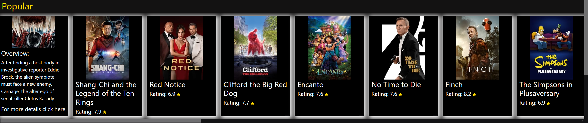
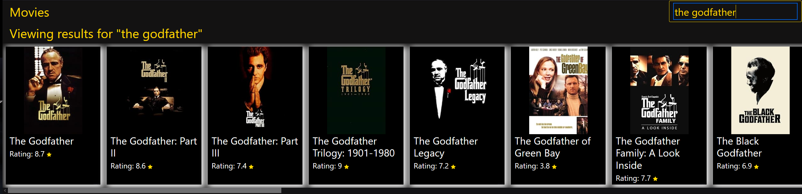
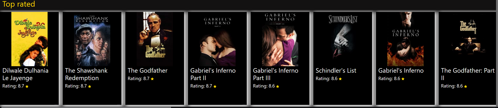

# Cinemafy

## Table of contents

- [Overview](#overview)
- [Installation](#installation)
- [Features](#features)
- [Screenshots](#screenshots)
- [Technologies](#technologies)

## Overview

This is a React application designed to showcase movie information fetched from an API. Users can browse through a variety of movies, view details, and search for specific titles.

## Installation

Navigate to the project directory:

```bash
  cd  Cinemafy
```

Install dependencies using npm:

```bash
  npm install
```

Start the development server:

```bash
  npm start
```

Open your browser and visit http://localhost:3000 to view the application.

## Features

- Browse a list of movies, including most popular, top rated, and newest releases.
- View detailed information about each movie, including title, release date, genre, and synopsis.
- Search for movies.
- Responsive design for seamless viewing on various devices.

## Screenshots

<br>
<br>
<br>

## Technologies

- React.js
- Bootstrap
- JavaScript
- HTML5
- CSS3
- [The Movie Database (TMDB) API](https://www.themoviedb.org/documentation/api)
